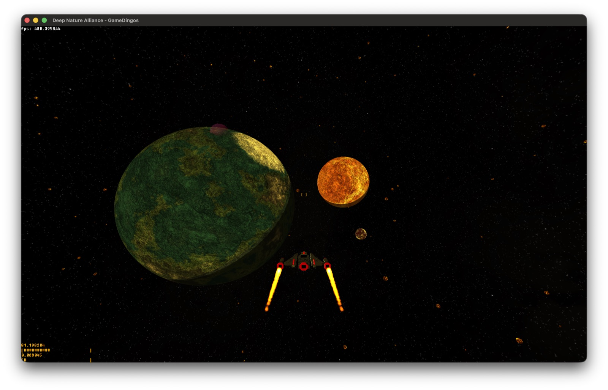
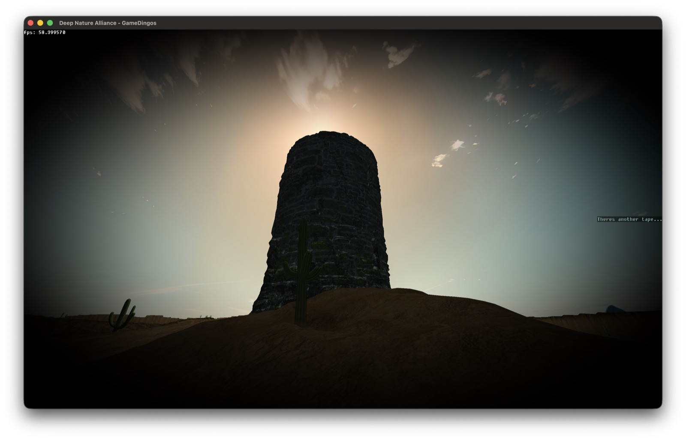
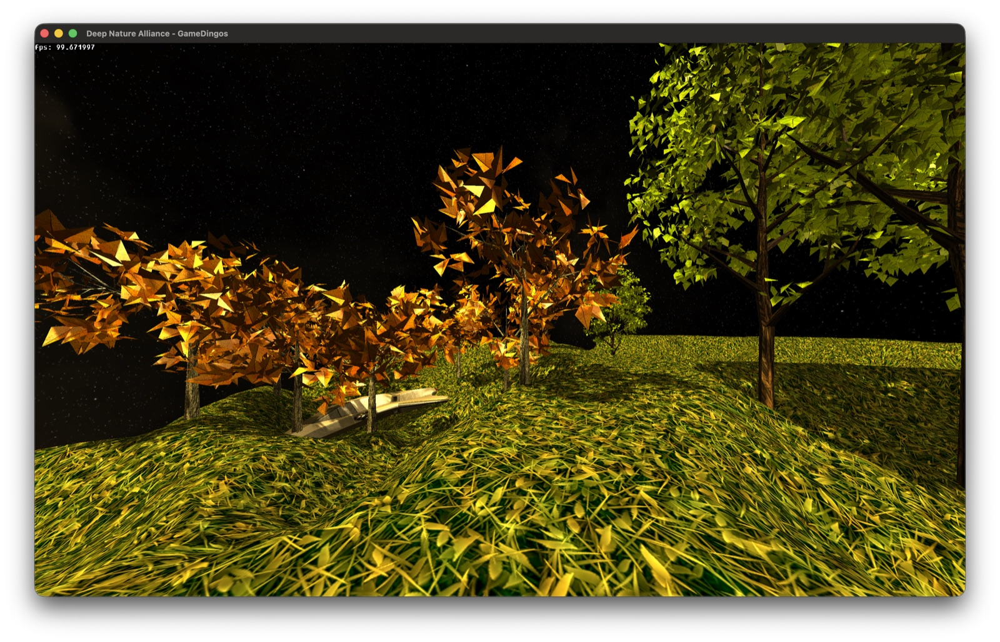
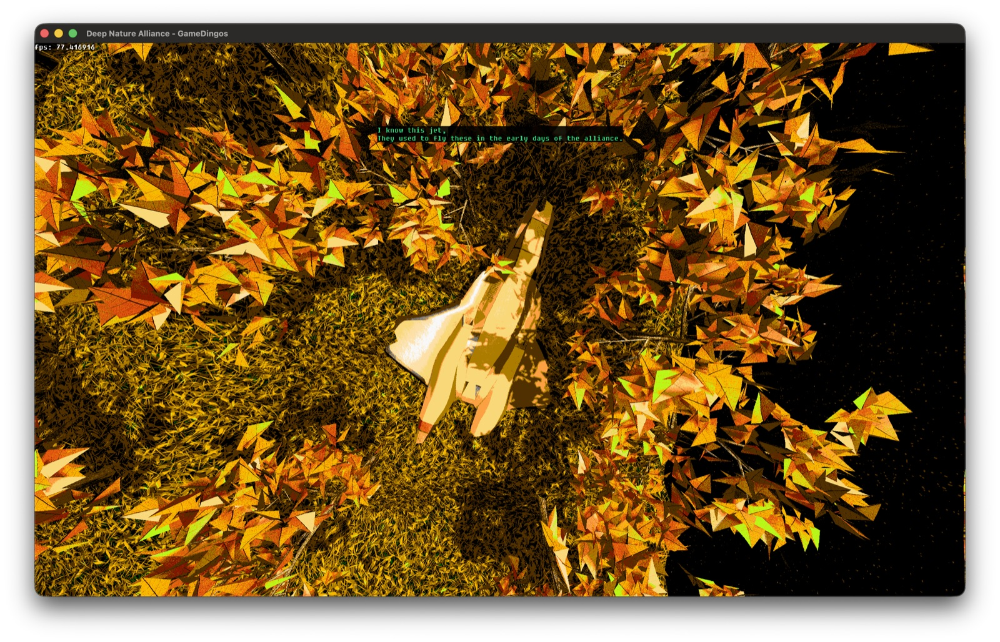
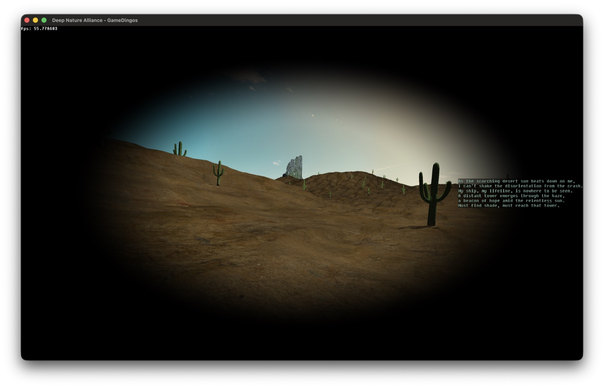
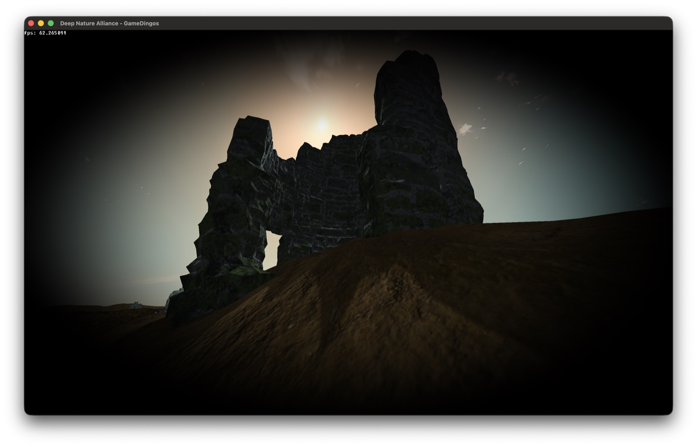
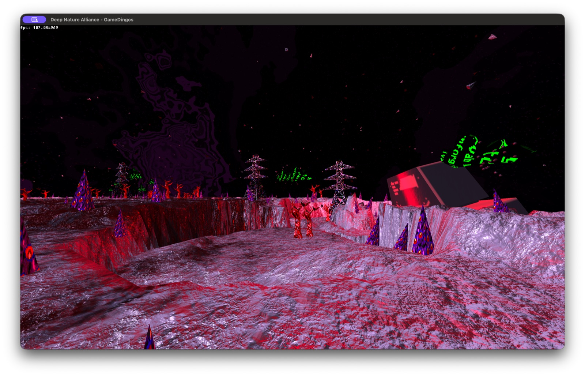
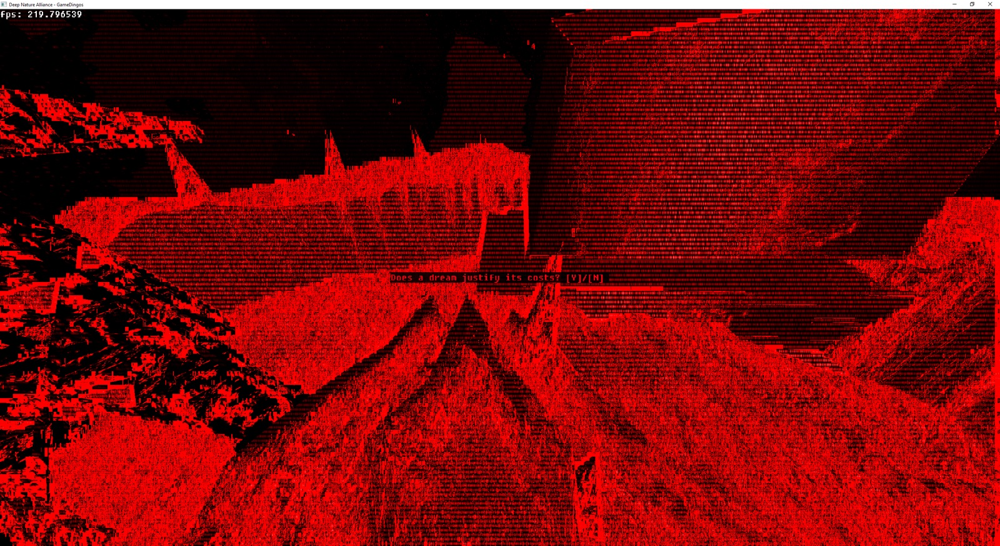

# Deep Nature Alliance

A story-driven 3D space exploration game, built on a custom C++ / OpenGL engine written from
scratch. Fly through asteroid fields and alien systems, then land and
explore derelict ruins on foot.

[](docs_images/ship-planetary-flyby.jpg)

[](docs_images/tower-backlit-shadows.jpg)

## Features

- Built entirely from scratch in C++ and OpenGL — no Unity, no Unreal, just a simple scene-graph engine and custom rendering pipeline
- Real soft shadows, cast from an high res shadow map that fades out naturally with distance instead of cutting off hard
- Proper lighting on every surface — ambient, diffuse, and specular from up to three dynamic lights at once, plus normal mapping for extra surface detail
- Grass, foliage, thrusters, and particle effects are all GPU-instanced through geometry shaders
- A few screen space post-processing looks (dithering, night vision, vignette)
- Runs natively on Windows, Linux, and macOS

<table>
<tr>
<td><a href="docs_images/forest-crash-site.jpg"></a></td>
<td><a href="docs_images/dither-fx-topdown.jpg"></a></td>
</tr>
<tr>
<td><a href="docs_images/desert-ruins-narrative.jpg"></a></td>
<td><a href="docs_images/tower-silhouette-bloom.jpg"></a></td>
</tr>
<tr>
<td><a href="docs_images/alien-biome.jpg"></a></td>
<td><a href="docs_images/ending.jpg"></a></td>
</tr>
</table>

## Building

### Dependencies

- CMake 3.x+ and a C++17 compiler
- GLFW, GLEW, and GLM headers are vendored under `libs/`

macOS and Linux also need the GLEW and GLFW libraries installed via a package manager (Windows
links the bundled static libs directly, no extra install needed):

```
# macOS
brew install cmake glew glfw

# Linux (Debian/Ubuntu)
sudo apt install build-essential cmake libglew-dev libglfw3-dev
```

### macOS / Linux

```
mkdir build && cd build
cmake ..
cmake --build . --parallel
./dna
```

### Windows (Visual Studio)

```
mkdir build
cd build
cmake ..
```

Open the generated `dna.sln`, set **dna** as the startup project, choose the **Release**
configuration, and build & run.

Resource paths (shaders, textures, meshes) are baked in as absolute paths at configure time, so
`dna` can be run from anywhere without copying assets alongside it.

## Gameplay

Press **J** at the title / Sun screen to start, or **R** to advance through dialogue. You can also skip
straight to a scene from the menu, or with number keys **1-7** (space flight, forest, desert,
alien planet, main menu, intro, credits).

Progress gates a couple of abilities: you start out on foot in the forest, and ship combat
(shooting) unlocks once you make it through that segment. Later, collecting all four recordings
scattered across the desert planet grants a jetpack — press **Space** again while airborne to
double jump, dashing forward for extra distance.

## Controls

**Mouse** — look around / steer. The cursor starts uncaptured; press **Esc** to capture it (press
again to release).

**Keyboard**

| Key | Action |
|---|---|
| `W` `A` `S` `D` | Move (on foot) / pitch & roll (in the ship) |
| `Q` `E` | Turn / yaw |
| `Space` | Jump, double jump once airborne with the jetpack (on foot) / fire (in the ship) |
| `Shift` | Thrust / boost |
| `Ctrl` | Brake |
| `X` | Attach or detach the camera |
| `Z` | Toggle cockpit camera |
| `C` | Toggle HUD |
| `R` | Advance story text |
| `Esc` | Capture / release the mouse |
| `1`-`7` | Jump to a scene |

## Attributions

- Planetary textures from [Solar System Scope](https://www.solarsystemscope.com/textures/) (CC BY 4.0)
- Habitable world textures from [Textures For Planets](https://www.texturesforplanets.com/texture-packs.shtml)
- Cactus meshes/textures from [Cactus Pack by YadroGames](https://sketchfab.com/3d-models/cactus-pack-588596f1601d48e6ad4cb24b31c3f33c)
- Desert texture from [PolyHaven](https://polyhaven.com/a/excavated_soil_wall)
- Ruined towers from [Pack of old towers in ruins by JB3D](https://sketchfab.com/3d-models/pack-of-old-towers-in-ruins-f213359c6cbb4c29bf8880764faa0fb8)
- Monastery from [Jvari Monastery by Nik](https://sketchfab.com/3d-models/jvari-monastery-9b70c349769a40b5a053c890693626f5)
- Low Spec Retro Computer - Commodore PET by pistachio, [OpenGameArt](https://opengameart.org) (CC-BY 4.0, texture modified)
